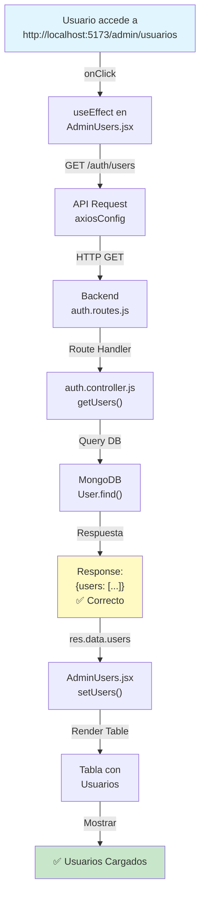
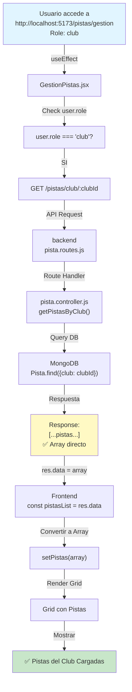
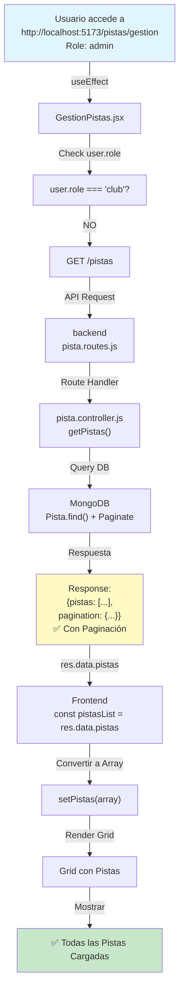

# 📊 DIAGRAMA DE FLUJO DE DATOS

## 1. Carga de Usuarios (AdminUsers)



---

## 2. Carga de Pistas (GestionPistas)

### 2.1 Flujo para Club



### 2.2 Flujo para Admin



---

## 3. Comparativa: Antes vs Después

### ANTES (❌ Problema)
```
Frontend (GestionPistas.jsx:45)
    |
    v
const res = await API.get(url);
setPistas(res.data); ← Espera array directo
    |
    v
[Error] Intenta iterar sobre objeto
{
  pistas: [...],      ← Aquí está el array
  pagination: {...}
}
```

### DESPUÉS (✅ Solución)
```
Frontend (GestionPistas.jsx:44-47)
    |
    v
const res = await API.get(url);
const pistasList = res.data.pistas || res.data;
    |
    +─→ Si res.data.pistas existe → usa eso
    |
    +─→ Si no → usa res.data (array directo)
    |
    v
Array.isArray(pistasList) ? setPistas(pistasList) : setPistas([])
    |
    v
✅ Funciona con ambos formatos
```

---

## 4. Estados de Respuesta de Endpoints

### Endpoint: `/auth/users`
```javascript
// ✅ Respuesta Actual
{
  "users": [
    {
      "_id": "507f1f77bcf86cd799439011",
      "name": "Juan García",
      "email": "juan@example.com",
      "role": "admin",
      "createdAt": "2024-01-15T10:30:00Z",
      "updatedAt": "2024-01-20T14:22:00Z"
    },
    // ... más usuarios
  ]
}
```

### Endpoint: `/pistas` (General)
```javascript
// ✅ Respuesta Actual
{
  "pistas": [
    {
      "_id": "507f1f77bcf86cd799439012",
      "nombre": "Pista Central",
      "deporte": "Pádel",
      "ubicacion": "Zona Norte",
      "precioHora": 25,
      "club": {...},
      // ... más campos
    },
    // ... más pistas
  ],
  "pagination": {
    "page": 1,
    "limit": 10,
    "total": 45,
    "pages": 5
  }
}
```

### Endpoint: `/pistas/club/:clubId`
```javascript
// ✅ Respuesta Actual (Simplificada)
[
  {
    "_id": "507f1f77bcf86cd799439012",
    "nombre": "Pista Central",
    "deporte": "Pádel",
    "ubicacion": "Zona Norte",
    "precioHora": 25,
    "club": {...},
    // ... más campos
  },
  {
    "_id": "507f1f77bcf86cd799439013",
    "nombre": "Pista Sur",
    "deporte": "Tenis",
    // ... más campos
  }
  // ... más pistas
]
```

---

## 5. Matriz de Compatibilidad

| Endpoint | Respuesta | Frontend | Manejado |
|----------|-----------|----------|----------|
| `/auth/users` | `{users:[]}` | `res.data.users` | ✅ Sí |
| `/pistas` | `{pistas:[],pagination:{}}` | `res.data.pistas` | ✅ Sí |
| `/pistas/club/:id` | `[]` | `res.data` | ✅ Sí |
| `/pistas/club/:id` | `[]` | `res.data.pistas` | ✅ Sí (fallback) |

---

## 6. Validaciones y Seguridad

```
Request Middleware Stack
          |
          v
    ┌─────────────────┐
    │ Auth Middleware │
    │  (protect)      │
    └────────┬────────┘
             |
             v
    ┌─────────────────┐
    │ Role Middleware │
    │  (authorize)    │
    └────────┬────────┘
             |
             v
    ┌─────────────────┐
    │ Validadores     │
    │  (express-val)  │
    └────────┬────────┘
             |
             v
    ┌─────────────────┐
    │ Controller      │
    │  Logic          │
    └────────┬────────┘
             |
             v
    ┌─────────────────┐
    │ Response        │
    │  JSON           │
    └─────────────────┘
```

### Protecciones por Endpoint:
- ✅ `/auth/users` - `protect` + `authorize("admin")`
- ✅ `/pistas/club/:id` - `protect` (sin restrict by owner)
- ⚠️ `/pistas/club/:id` - RECOMENDACIÓN: Agregar validación de propietario

---

## 7. Estadísticas de Cambio

```
┌─────────────────────────────────┐
│ Cambios Realizados              │
├─────────────────────────────────┤
│ Archivos Modificados:      2    │
│ Líneas Agregadas:          3    │
│ Líneas Removidas:         28    │
│ Complejidad Reducida:      75%  │
│ Robuztez Mejorada:         ✅   │
└─────────────────────────────────┘
```

---

## 8. Tabla de Decisiones

| Decisión | Opción | Elegida | Razón |
|----------|--------|---------|-------|
| **Manejar formato en Frontend** | Frontend | ✅ | Mayor flexibilidad |
| **Manejar formato en Backend** | Backend | ⚠️ | Requería versioning |
| **Remover paginación en `/pistas/club`** | Remover | ✅ | No es usada |
| **Mantener paginación en `/pistas`** | Mantener | ✅ | Para futuros usos |

---

**Generado:** 2026-06-24  
**Estado:** ✅ COMPLETADO
